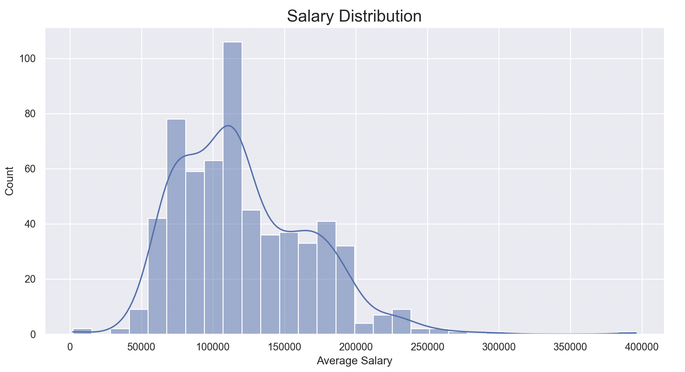
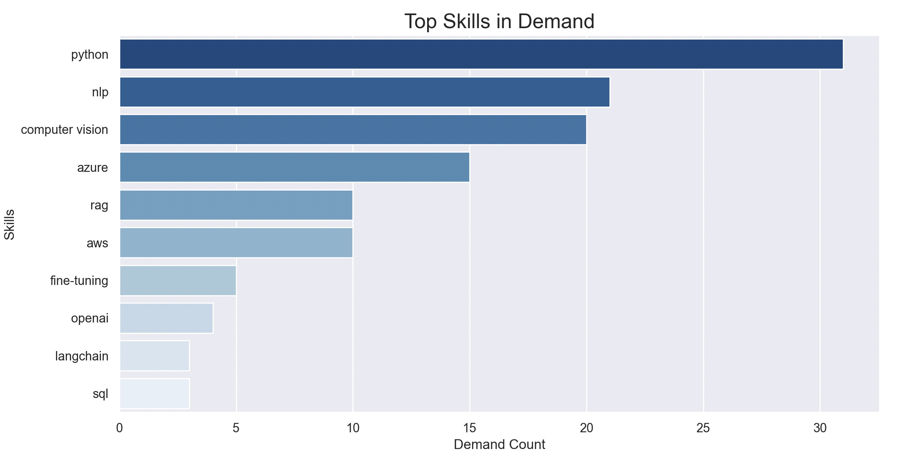
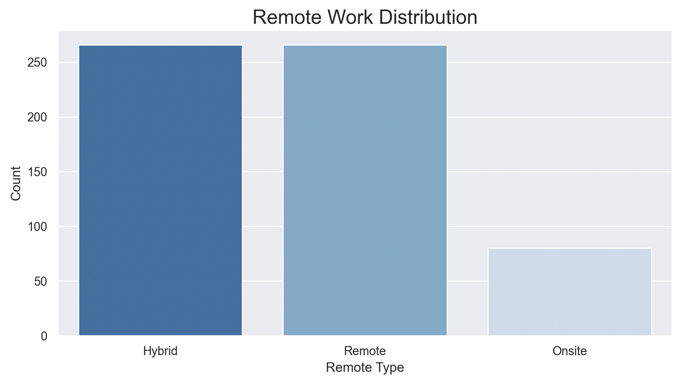

# AI Job Market Analysis 2026

## 📊 Project Overview

This project analyzes the global AI job market using Python and data visualization libraries to identify hiring trends, salary patterns, skill demand, and remote work opportunities.

The goal was to simulate a real-world data analyst workflow:
- clean raw job market data
- analyze hiring trends
- create visualizations
- generate business insights
- provide strategic recommendations

---

# 🎯 Project Goals

The main objectives of this project were:

- Identify the highest-paying AI job locations
- Discover the most in-demand technical skills
- Compare remote vs onsite salary trends
- Analyze hiring patterns across companies
- Practice real-world data cleaning and visualization techniques
- Build a portfolio-ready data analytics project

---

# 🛠 Tools & Technologies

- Python
- Pandas
- Matplotlib
- Seaborn
- Plotly
- VS Code

---

# 🧹 Data Cleaning Process

The dataset was cleaned and transformed using pandas.

### Cleaning steps:
- Removed duplicate job postings
- Handled missing salary values
- Standardized city and country names
- Removed invalid locations
- Created average salary feature
- Filtered unrealistic salary values

---

# 🔬 Methodology

The analysis process followed these stages:

## 1. Data Collection
Imported AI job market dataset containing:
- salaries
- locations
- skills
- companies
- remote types
- experience levels

## 2. Data Cleaning
Used pandas to:
- remove duplicates
- fix missing values
- standardize formatting

## 3. Exploratory Data Analysis (EDA)
Performed analysis on:
- salary distributions
- hiring demand
- top locations
- remote work patterns
- technical skill demand

## 4. Data Visualization
Created:
- histograms
- bar charts
- heatmaps

using matplotlib and seaborn.

## 5. Business Insights
Generated business-focused conclusions and career recommendations based on findings.

---

# 📈 Key Insights

- Some cities consistently offer significantly higher AI salaries
- Remote jobs remain highly competitive in compensation
- Python and cloud-related skills dominate AI hiring demand
- AI hiring is concentrated in major technology hubs
- Companies increasingly seek hybrid technical/business skillsets

---

# 📊 Visualizations

## Salary Distribution

## Top Skills

## Remote Work Distribution

---

# 📌 Business Conclusions

## 1. AI Hiring Is Concentrated In Major Tech Cities

### WHY?
Large technology ecosystems attract AI investment, startups, and enterprise hiring.

### SO WHAT?
Professionals in major cities may access more opportunities and higher salaries.

### ACTION
Candidates should target major AI hubs or remote-friendly companies to increase career opportunities.

---

## 2. Remote AI Jobs Remain Highly Competitive

### WHY?
Companies are increasingly comfortable hiring globally for AI talent.

### SO WHAT?
Location barriers are decreasing for skilled professionals.

### ACTION
Develop strong remote collaboration and communication skills alongside technical expertise.

---

## 3. Python Continues To Dominate AI Hiring

### WHY?
Python remains the industry standard for AI, automation, machine learning, and analytics.

### SO WHAT?
Candidates without Python skills risk reduced competitiveness in the AI job market.

### ACTION
Prioritize learning:
- Python
- pandas
- SQL
- machine learning fundamentals

---

## 4. Salary Levels Increase With Experience

### WHY?
Senior AI professionals bring advanced technical and strategic expertise.

### SO WHAT?
Specialization and long-term skill development significantly improve earning potential.

### ACTION
Focus on:
- portfolio projects
- certifications
- real-world problem solving
- continuous learning

---

## 5. Companies Value Multi-Skilled Candidates

### WHY?
Modern AI roles increasingly combine:
- analytics
- engineering
- cloud systems
- communication skills

### SO WHAT?
Purely theoretical knowledge is no longer enough.

### ACTION
Build projects combining:
- coding
- visualization
- business analysis
- storytelling

---

# 📂 Dataset

Dataset used:
[AI Jobs Dataset](https://www.kaggle.com/datasets/atharvasoundankar/ai-job-market-global-2026?utm_source=chatgpt.com&select=ai_jobs_global.csv)

---

# 👨‍💻 Author

Sarbast
